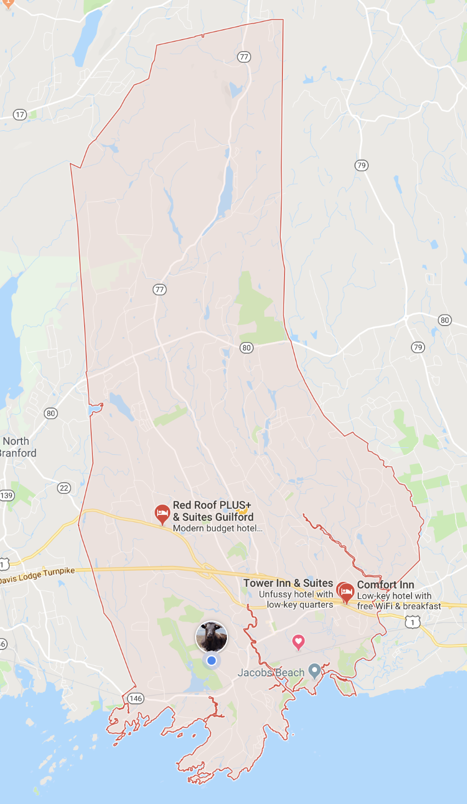

Voter lists are processed by guilford_voters.Rmd 



```{r}
guilford_center_lat <- 41.32
guilford_center_lon <- -72.699986
guilford_left_bottom_lon <- -72.749185
guilford_left_bottom_lat <- 41.242489
guilford_right_top_lon <- -72.631308
guilford_right_top_lat <- 41.436585
guilford_boundaries <- c(left = guilford_left_bottom_lon, bottom = guilford_left_bottom_lat,
                         right = guilford_right_top_lon, top = guilford_right_top_lat)
guilford_base <- ggmap(get_map(location = guilford_boundaries, zoom = 11,
              maptype = "roadmap", source = "google"))
guilford_base <- ggmap(get_map(location = guilford_boundaries, zoom = 11,
              maptype = "roadmap", source = "google"))
guilford_base12 <- ggmap(get_map(location = guilford_boundaries, zoom = 12,
              maptype = "roadmap", source = "google"))
guilford_osm <- get_openstreetmap(bbox = guilford_boundaries,filename = "guilford_osm",
                                  format = "png", scale = 22000)
paste(min(lines3$lon, na.rm = TRUE), max(lines3$lon, na.rm = TRUE), 
      min(lines3$lat, na.rm = TRUE), max(lines3$lat, na.rm = TRUE))
```

```{r}
p <- guilford_base + geom_point(data = lines3 %>% sample_frac(size = 0.5), aes(x = lon, y = lat, color = party2), size = 0.1) +
  facet_wrap(~ party2) +
  xlim(c(guilford_left_bottom_lon, guilford_right_top_lon)) +
  ylim(c(guilford_left_bottom_lat, guilford_right_top_lat)) + 
  scale_color_manual(values=c("blue", "green", "red"))
```


```{r}
detail_left_bottom_lon <- -72.710723
detail_left_bottom_lat <- 41.266398
detail_right_top_lon <- -72.696524
detail_right_top_lat <- 41.280105
detail_boundaries <- c(left = detail_left_bottom_lon, bottom = detail_left_bottom_lat,
                         right = detail_right_top_lon, top = detail_right_top_lat)
home_base <- ggmap(get_map(location = detail_boundaries, zoom = 15,
              maptype = "satellite", source = "google"))

p <- home_base + geom_point(data = google_addr %>% sample_frac(size = 0.95), aes(x = lon, y = lat), size = 1, colour = "red") +
  xlim(c(detail_left_bottom_lon, detail_right_top_lon)) +
  ylim(c(detail_left_bottom_lat, detail_right_top_lat))
```

